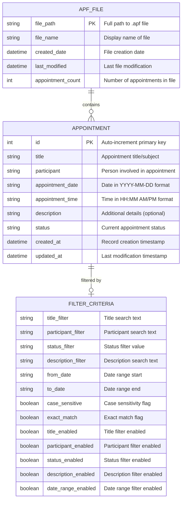

# Entity Relationship Diagram

This document presents the entity relationship diagram for the Appointment Manager application, showing the data structure and relationships.

## Entity Relationship Diagram



## Entity Descriptions

### 📅 APPOINTMENT Entity
The core data entity representing individual appointments.

**Primary Key**: `id` (Auto-increment integer)

**Required Fields**:
- `title`: What the appointment is about
- `participant`: Who is involved in the appointment
- `appointment_date`: When the appointment occurs (date)
- `appointment_time`: When the appointment occurs (time)
- `status`: Current state of the appointment

**Optional Fields**:
- `description`: Additional notes or details

**Audit Fields**:
- `created_at`: Automatically set when record is created
- `updated_at`: Automatically updated when record is modified

**Status Values**:
- "Scheduled" (default)
- "Confirmed"
- "In Progress"
- "Completed"
- "Cancelled"
- "No Show"

### 📁 APF_FILE Entity
Represents the .apf (Appointment File) container that holds appointments.

**Primary Key**: `file_path` (Full file system path)

**Metadata Fields**:
- `file_name`: User-friendly display name
- `created_date`: When file was first created
- `last_modified`: When file was last saved
- `appointment_count`: Cached count for performance

**File Format**: SQLite database with .apf extension

### 🔍 FILTER_CRITERIA Entity
Represents the current filtering state for appointment searches.

**Filter Fields**:
- Text filters for title, participant, description
- Status dropdown filter
- Date range filter (from/to dates)

**Configuration Flags**:
- Individual enable/disable flags for each filter type
- Case sensitivity option
- Exact match vs. partial match option

**Lifecycle**: Temporary entity, not persisted to database

## Relationships

### APF_FILE → APPOINTMENT (One-to-Many)
- **Cardinality**: One APF file contains zero or many appointments
- **Referential Integrity**: Appointments exist within a single file context
- **Cascade**: Deleting a file removes all contained appointments
- **Implementation**: File path is the container, not a foreign key

### APPOINTMENT → FILTER_CRITERIA (Many-to-One)
- **Cardinality**: Many appointments can match one filter criteria
- **Relationship Type**: Filtering relationship (not storage)
- **Implementation**: Predicate-based filtering, not database relationship
- **Lifecycle**: Filter criteria is session-based, not persisted

## Data Types and Constraints

### String Fields
```sql
title TEXT NOT NULL
participant TEXT NOT NULL  
appointment_date TEXT NOT NULL  -- Format: YYYY-MM-DD
appointment_time TEXT NOT NULL  -- Format: HH:MM AM/PM
description TEXT               -- Optional, can be NULL
status TEXT NOT NULL DEFAULT 'Scheduled'
```

### Datetime Fields
```sql
created_at DATETIME DEFAULT CURRENT_TIMESTAMP
updated_at DATETIME DEFAULT CURRENT_TIMESTAMP
```

### Constraints
- **NOT NULL**: Title, participant, date, time, and status are required
- **DEFAULT VALUES**: Status defaults to "Scheduled", timestamps auto-populate
- **PRIMARY KEY**: Auto-incrementing ID ensures uniqueness
- **DATA INTEGRITY**: SQLite handles basic constraints

## Physical Storage

### SQLite Database Schema
```sql
CREATE TABLE IF NOT EXISTS appointments (
    id INTEGER PRIMARY KEY AUTOINCREMENT,
    title TEXT NOT NULL,
    participant TEXT NOT NULL,
    appointment_date TEXT NOT NULL,
    appointment_time TEXT NOT NULL,
    description TEXT,
    status TEXT NOT NULL DEFAULT 'Scheduled',
    created_at DATETIME DEFAULT CURRENT_TIMESTAMP,
    updated_at DATETIME DEFAULT CURRENT_TIMESTAMP
);
```

### File System Structure
```
appointment_data.apf     -- SQLite database file
├── appointments table   -- Main data table
├── sqlite_master       -- SQLite metadata
└── [indexes]           -- Auto-created indexes
```

## Data Flow and Lifecycle

### Appointment Lifecycle
1. **Creation**: New appointment inserted with auto-generated ID
2. **Reading**: Loaded from SQLite into ObservableList
3. **Updates**: Modified in-memory, immediately persisted to database
4. **Deletion**: Removed from both memory and database
5. **Archival**: Exists in .apf file until file is deleted

### Filter Lifecycle
1. **Creation**: User opens filter dialog
2. **Configuration**: User sets filter criteria
3. **Application**: Predicate applied to ObservableList
4. **Persistence**: Filter state maintained during session
5. **Reset**: Cleared when filters are reset or app restarts

## Data Integrity Measures

- **Automatic Timestamps**: Creation and modification times tracked
- **Required Field Validation**: Form validation before database insert
- **Transaction Safety**: SQLite provides ACID compliance
- **Backup Strategy**: .apf files can be copied/backed up externally
- **Error Handling**: Database errors logged, UI remains stable
