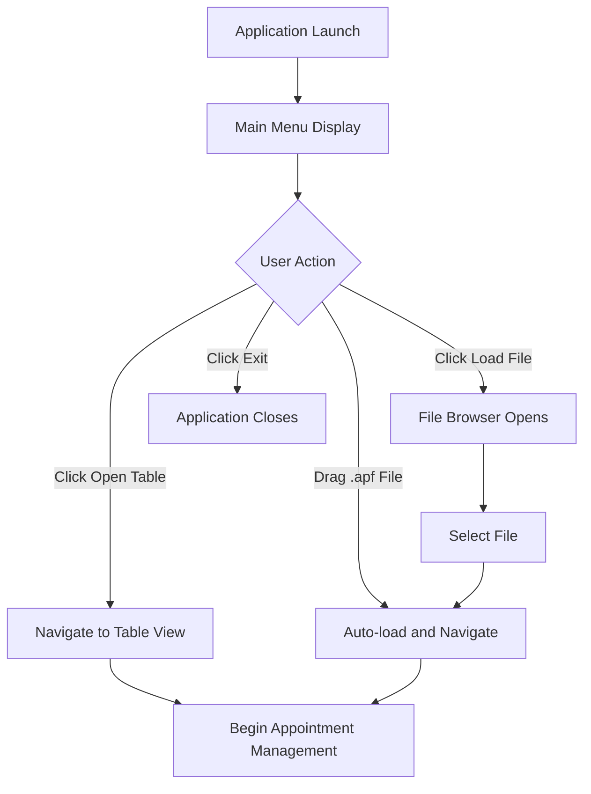

# 📋 Main Menu Overview

## What is the Main Menu?

The Main Menu is the **starting point** and **primary navigation hub** of the Appointment Manager application. It provides users with a clean, intuitive interface to begin their appointment management journey.

## Core Purpose

The main menu serves three primary functions:

1. **🏠 Welcome & Orientation** - Greets users and provides context
2. **🚀 Quick Start** - Offers immediate pathways to begin work
3. **📁 File Management** - Enables loading existing appointment files

## Visual Overview

```
┌─────────────────────────────────────────────────────┐
│  [−] [□] [×]    Appointment Manager                 │
├─────────────────────────────────────────────────────┤
│                                                     │
│  [Open Table]     Good [morning/afternoon/evening]  │
│  [Load File]                                        │
│                   ┌───────────────────────────────┐ │
│                   │                               │ │
│  ────────────     │    Drop .apf files here       │ │
│                   │                               │ │
│  [Exit]           └───────────────────────────────┘ │
│                                                     │
└─────────────────────────────────────────────────────┘
```

## Key Features

### 🌅 Dynamic Greeting System
- Displays time-appropriate greetings (Good morning/afternoon/evening)
- Updates automatically based on system time
- Creates a personalized user experience

### 🎯 One-Click Navigation
- **Open Table** - Direct access to appointment management
- **Load File** - Browse and open existing appointment files
- **Exit** - Clean application shutdown

### 📥 Drag & Drop Interface
- Visual drop zone for .apf (appointment) files
- Real-time feedback during drag operations
- Automatic file validation and loading

### 🎨 Modern Design
- Dark theme for reduced eye strain
- Custom title bar with window controls
- Responsive layout adapting to window size

## User Journey



## Design Philosophy

### Simplicity First
- Minimal visual clutter
- Clear, actionable options
- Intuitive user flow

### Efficiency Focus
- Quick access to main features
- Multiple ways to achieve the same goal
- Reduced friction for common tasks

### Professional Appearance
- Consistent with business application standards
- Modern, clean aesthetic
- Attention to visual hierarchy

## Success Metrics

The main menu is considered successful when users can:
- ✅ Understand their options within 3 seconds
- ✅ Start managing appointments in 1-2 clicks
- ✅ Load existing files without confusion
- ✅ Navigate the interface without training

---
**Next:** [🏗️ Architecture](./02-architecture.md) - Dive into the technical architecture and design patterns
