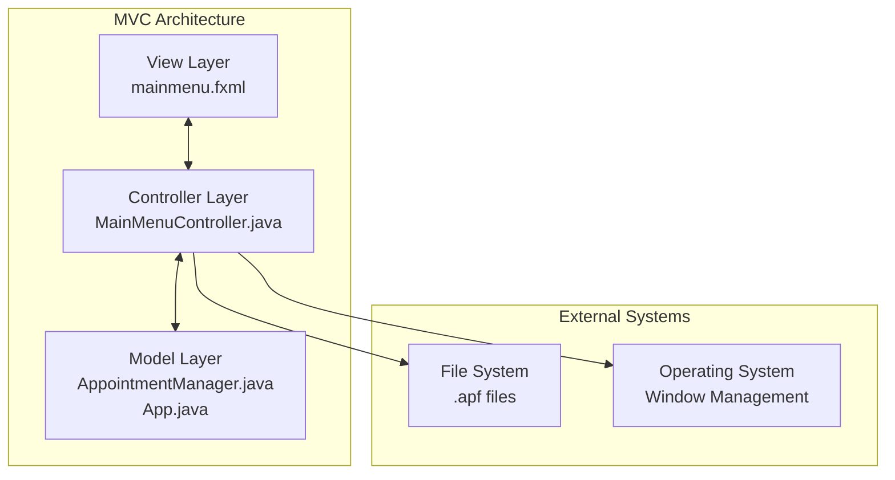
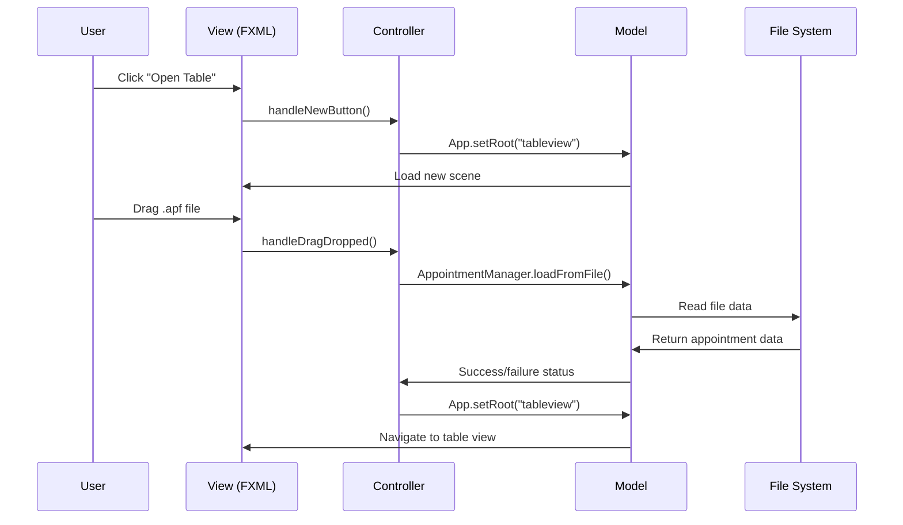

# 🏗️ Main Menu Architecture

## Architectural Pattern

The Main Menu follows the **Model-View-Controller (MVC)** architectural pattern, ensuring clear separation of concerns and maintainable code structure.



## Component Breakdown

### 🎨 View Layer (`mainmenu.fxml`)
**Responsibility:** User interface definition and layout

```xml
Key Components:
├── BorderPane (Root Container)
├── Custom Title Bar (HBox)
│   ├── App Logo & Title
│   └── Window Controls (Minimize, Maximize, Close)
├── Left Sidebar (VBox)
│   ├── Action Buttons
│   └── Exit Button
└── Center Area (BorderPane)
    ├── Dynamic Greeting
    └── Drag & Drop Zone
```

**Design Patterns:**
- **Container Hierarchy** - Nested layout containers for responsive design
- **Resource Binding** - External CSS and image resources
- **Event Binding** - FXML-to-controller method mapping

### 🎮 Controller Layer (`MainMenuController.java`)

**Responsibility:** Business logic, event handling, and view coordination

```java
Class Structure:
├── FXML Injected Components (@FXML fields)
├── Window Management (drag, minimize, maximize, close)
├── Navigation Control (scene switching)
├── File Operations (load, drag & drop)
├── UI State Management (greeting, visual feedback)
└── Event Handlers (button clicks, drag events)
```

**Design Patterns:**
- **Event-Driven Architecture** - Responds to user interactions
- **Delegation Pattern** - Delegates complex operations to other components
- **State Management** - Manages UI state and visual feedback

### 📊 Model Layer (`AppointmentManager.java`, `App.java`)

**Responsibility:** Data management and application state

```java
Model Components:
├── AppointmentManager (Singleton)
│   ├── Data Operations
│   ├── File I/O Management
│   └── State Persistence
└── App (Application Entry Point)
    ├── Scene Management
    ├── Stage Configuration
    └── Navigation Control
```

## Data Flow Architecture



## Key Architectural Decisions

### 🎯 Singleton Pattern for App State
**Decision:** Use singleton pattern for `AppointmentManager`
**Rationale:** 
- Ensures single source of truth for appointment data
- Provides global access point for data operations
- Simplifies data consistency across views

### 🔄 Scene-Based Navigation
**Decision:** Use `App.setRoot()` for navigation between views
**Rationale:**
- Centralized navigation control
- Consistent scene management
- Memory efficient (single window, multiple scenes)

### 🎨 FXML-Based UI Declaration
**Decision:** Separate UI definition from logic using FXML
**Rationale:**
- Clear separation of concerns
- Designer-developer workflow support
- Easier UI maintenance and modifications

### 🖱️ Event-Driven Interaction Model
**Decision:** Use JavaFX event system for user interactions
**Rationale:**
- Responsive user experience
- Decoupled event handling
- Standard JavaFX patterns

## Integration Points

### 📁 File System Integration
```java
Integration Method: FileChooser API & Drag/Drop Events
Purpose: Load existing appointment files
Error Handling: File validation, format checking
```

### 🪟 Operating System Integration
```java
Integration Method: Stage manipulation, custom title bar
Purpose: Native window behavior without OS decorations
Features: Drag to move, minimize, maximize, close
```

### 🔄 Application Navigation
```java
Integration Method: Scene switching via App.setRoot()
Purpose: Navigate between main menu and table view
State Management: Preserve data across scene changes
```

## Performance Considerations

### 💾 Memory Management
- **Lazy Loading** - Resources loaded only when needed
- **Event Cleanup** - Proper event handler management
- **Scene Reuse** - Efficient scene switching without recreation

### ⚡ Responsiveness
- **Async Operations** - File operations don't block UI
- **Visual Feedback** - Immediate response to user actions
- **Efficient Rendering** - Optimized layout calculations

## Security Considerations

### 📋 File Validation
- **Extension Checking** - Only .apf files accepted
- **Content Validation** - Verify file format before processing
- **Error Handling** - Graceful failure for invalid files

### 🛡️ Input Sanitization
- **Path Validation** - Secure file path handling
- **Event Filtering** - Validate drag/drop sources

---
**Next:** [🎨 User Interface](./03-user-interface.md) - Explore the UI components and design system
