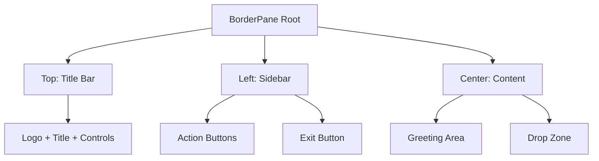

# 🎨 Main Menu User Interface

## Design System Overview

The Main Menu implements a modern, dark-themed design system that prioritizes usability, accessibility, and professional appearance.

## Visual Hierarchy

```
Priority Level 1: Primary Actions
├── "Open Table" button (Green, prominent)
└── Greeting text (Large, centered)

Priority Level 2: Secondary Actions  
├── "Load from file" button (White, standard)
└── Drag & drop area (Subtle, spacious)

Priority Level 3: Utility Actions
├── Window controls (Minimize, maximize, close)
└── Exit button (Bottom placement)
```

## Color Palette

### Primary Colors
```css
Background Primary:   #151515 (Very dark gray)
Background Secondary: #202020 (Dark gray)
Background Tertiary:  #252525 (Medium dark gray)
```

### Accent Colors
```css
Primary Action:   #09ab72 (Green - success, start)
Secondary Action: #ffffff (White - neutral, load)
Text Primary:     #ffffff (White - high contrast)
Text Secondary:   #686868 (Gray - subtle information)
```

### Interactive States
```css
Drag Valid:    #2a4d3a (Dark green background)
Drag Invalid:  #4d2a2a (Dark red background)
Hover States:  Slight opacity changes
```

## Layout Structure

### 🏗️ Container Hierarchy

```
BorderPane (Root - 1000x600px)
├── Top: Title Bar Area (60px height)
│   └── HBox: Custom title bar with controls
├── Left: Navigation Sidebar (214px width)
│   └── VBox: Action buttons and exit
└── Center: Main Content Area (786px width)
    └── BorderPane: Greeting and drop zone
```

### 📐 Responsive Design



## Component Specifications

### 🎯 Action Buttons

#### Primary Button ("Open Table")
```css
Dimensions: 120px × 35px
Background: #09ab72 (Green)
Border Radius: 15px
Font: System Bold, 12px
Text Color: White
Margin: 20px left, 30px top
```

#### Secondary Button ("Load from file")
```css
Dimensions: 120px × 35px  
Background: White
Border Radius: 50px
Font: System Regular, 12px
Text Color: Black
Margin: 20px left, 20px top
```

#### Exit Button
```css
Dimensions: 90px × 35px
Background: White
Border Radius: 15px
Font: System Bold, 12px
Text Color: Black
Position: Bottom left, 20px margins
```

### 🪟 Custom Title Bar

#### Components
```
Logo Icon (26×23px) → App Title → Spacer → Window Controls
```

#### Window Control Buttons
```css
Minimize Button: "–" (12px font)
Maximize Button: "□" (12px font)  
Close Button:    "×" (14px font, red on hover)
All: Transparent background, white text, 5-10px padding
```

### 💬 Dynamic Greeting

#### Behavior
```javascript
Time Range → Greeting Text
05:00-11:59 → "Good morning"
12:00-17:59 → "Good afternoon"  
18:00-04:59 → "Good evening"
```

#### Styling
```css
Font Size: 25px
Color: White
Alignment: Center
Margin: 30px bottom
Position: Top center of content area
```

### 📥 Drag & Drop Zone

#### Default State
```css
Dimensions: 666px × 330px (center area)
Background: #252525
Border Radius: 5px
Text: "Drop and drop .apf files here"
Text Color: #6b6b6b
```

#### Interactive States

**Valid File Hover:**
```css
Background: #2a4d3a (Dark green)
Border: 2px solid #09ab72 (Green)
Text: "Release to load file"
Text Color: #09ab72 (Green)
```

**Invalid File Hover:**
```css
Background: #4d2a2a (Dark red)
Border: 2px solid #ab0909 (Red)
Text: "Only .apf files allowed"
Text Color: #ab0909 (Red)
```

## Accessibility Features

### 🎯 Focus Management
- **Tab Order**: Logical navigation sequence
- **Focus Indicators**: Visible focus states on interactive elements
- **Keyboard Navigation**: All actions accessible via keyboard

### 🔤 Text Accessibility
- **High Contrast**: White text on dark backgrounds
- **Font Sizes**: Minimum 12px for readability
- **Clear Hierarchy**: Size and weight differentiate importance

### 🎨 Visual Accessibility
- **Color Independence**: Information not conveyed by color alone
- **Adequate Spacing**: Sufficient padding and margins
- **Clear Boundaries**: Visual separation between interactive areas

## Animation & Feedback

### 🎭 Visual Feedback States

#### Button Interactions
```
Hover: Slight opacity change (0.8)
Click: Brief scale animation (0.95)
Disabled: Reduced opacity (0.5)
```

#### Drag & Drop Feedback
```
Drag Enter: Smooth color transition (200ms)
Drag Exit: Return to default state (200ms)
Drop Success: Brief success flash
Drop Error: Brief error indication
```

### ⚡ Performance Optimizations
- **CSS Transitions**: Hardware-accelerated when possible
- **Minimal Repaints**: Efficient update strategies
- **Smooth Animations**: 60fps target for interactions

## Responsive Behavior

### 🔄 Window Resizing
- **Minimum Size**: 1000×600px maintained
- **Layout Flexibility**: BorderPane adapts to size changes
- **Content Preservation**: Core functionality always visible

### 📱 Scaling Considerations
- **DPI Awareness**: Proper scaling on high-DPI displays
- **Font Scaling**: Respects system font size preferences
- **Icon Clarity**: Vector-based icons for sharp rendering

## Style Implementation

### 📄 CSS Architecture
```
External Stylesheets:
├── mainmenuButtonStyle.css (Button-specific styles)
└── Inline Styles (FXML embedded styles)

Style Priorities:
1. Inline FXML styles (highest)
2. External CSS classes
3. JavaFX default styles (lowest)
```

### 🎨 Theme Consistency
- **Color Variables**: Consistent color usage across components
- **Typography Scale**: Harmonious font size relationships
- **Spacing System**: Consistent margin and padding values

---
**Next:** [⚙️ Functionality](./04-functionality.md) - Explore the core features and user interactions
