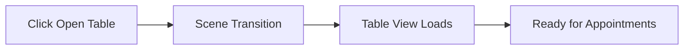
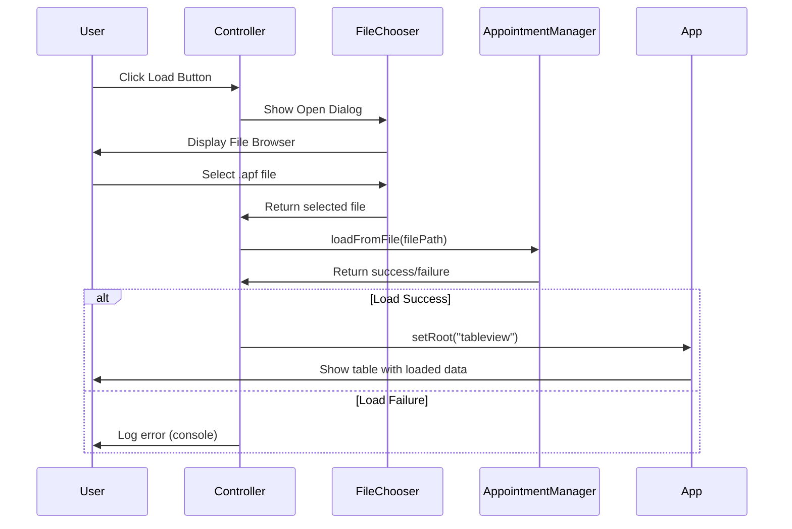

# ⚙️ Main Menu Functionality

## Core Features Overview

The Main Menu provides four primary functional areas that enable users to efficiently start their appointment management workflow.

## 🚀 Navigation Features

### 1. Open Table (Primary Action)
**Purpose:** Launch the main appointment management interface

```java
Trigger: Click "Open Table" button
Action: App.setRoot("tableview")
Result: Navigate to appointment table view
Data State: Initialize empty appointment list (if none exists)
```

**User Flow:**


**Error Handling:**
- FXML loading failures are logged to console
- Application remains stable if navigation fails
- User can retry the action

### 2. Load from File (Secondary Action)
**Purpose:** Open existing appointment files through file browser

```java
Trigger: Click "Load from file" button
Action: FileChooser.showOpenDialog()
Filter: *.apf files only
Result: Load appointments and navigate to table view
```

**Detailed Flow:**


**Features:**
- **File Type Filtering:** Only .apf files selectable
- **Path Validation:** Secure file path handling
- **Error Recovery:** Graceful handling of corrupt files

## 📥 Drag & Drop System

### Visual States & Feedback

#### Default State
```css
Appearance: Subtle gray drop zone
Text: "Drop and drop .apf files here"
Behavior: Passive waiting for drag events
```

#### Active Drag Detection
```java
Event: OnDragOver
Validation: Check for .apf file extension
Response: Change visual state based on file validity
```

#### Valid File Feedback
```css
Background: Green tinted (#2a4d3a)
Border: Green outline (#09ab72)
Text: "Release to load file"
Cursor: Visual drop indicator
```

#### Invalid File Feedback
```css
Background: Red tinted (#4d2a2a)
Border: Red outline (#ab0909)
Text: "Only .apf files allowed"
Cursor: No-drop indicator
```

### Drag & Drop Implementation

#### Event Handling Chain
```java
1. handleDragOver()
   ├── Detect drag source
   ├── Validate file type (.apf)
   ├── Accept/reject transfer mode
   └── Update visual feedback

2. handleDragEntered()
   ├── Change drop zone appearance
   ├── Update instruction text
   └── Provide visual confirmation

3. handleDragExited()
   ├── Reset visual state
   └── Clear feedback messages

4. handleDragDropped()
   ├── Process dropped file
   ├── Load appointment data
   ├── Navigate to table view
   └── Reset drop zone
```

#### File Processing Logic
```java
Validation Steps:
1. Check file exists and is readable
2. Verify .apf extension (case-insensitive)
3. Attempt to parse file content
4. Load data into AppointmentManager

Success Path:
- Data loaded successfully
- Navigate to table view
- Display loaded appointments

Error Path:
- Log error details
- Remain on main menu
- Maintain current state
```

## 🪟 Window Management

### Custom Title Bar System
**Purpose:** Provide native window controls without OS decorations

#### Window Dragging
```java
Implementation: Mouse event handling on title bar
Events: onMousePressed + onMouseDragged
Behavior: Calculate offset and move window accordingly
```

**Drag Logic:**
```java
onMousePressed: Record initial click position (xOffset, yOffset)
onMouseDragged: Calculate new window position
               stage.setX(screenX - xOffset)
               stage.setY(screenY - yOffset)
```

#### Window Controls

**Minimize Button:**
```java
Action: stage.setIconified(true)
Visual: "–" character
Effect: Hide window to taskbar
```

**Maximize/Restore Button:**
```java
Action: stage.setMaximized(!stage.isMaximized())
Visual: "□" character  
Effect: Toggle between maximized and restored state
```

**Close Button:**
```java
Action: Platform.exit()
Visual: "×" character
Effect: Graceful application shutdown
```

## 🌅 Dynamic Greeting System

### Time-Based Logic
```java
Time Detection: LocalTime.now().getHour()

Greeting Rules:
├── 05:00-11:59 → "Good morning"
├── 12:00-17:59 → "Good afternoon"
└── 18:00-04:59 → "Good evening"
```

### Implementation Details
```java
Update Timing: On application start (initialize())
Display: Immediate update in greetLabel
Persistence: Static throughout session
```

**User Experience Benefits:**
- **Personalization:** Feels tailored to user's time
- **Context Awareness:** Reflects current time of day
- **Professional Touch:** Attention to user experience details

## 🚪 Exit Functionality

### Safe Application Closure
```java
Trigger: Click "Exit" button
Action: Platform.exit()
Behavior: Graceful JavaFX application shutdown
```

**Shutdown Sequence:**
1. **Event Processing:** Complete pending UI events
2. **Resource Cleanup:** Release JavaFX resources
3. **Thread Termination:** Close JavaFX Application Thread
4. **JVM Exit:** Normal process termination

## 🔄 State Management

### Application State Coordination

#### Scene State
```java
Current Scene: Main Menu (active)
Navigation Target: Table View (on user action)
State Preservation: AppointmentManager singleton maintains data
```

#### Data State
```java
Appointment Data: Managed by AppointmentManager singleton
File State: Current loaded file (if any)
UI State: Current greeting, visual feedback states
```

### Error Recovery

#### Navigation Failures
```java
Fallback: Remain on current scene
Logging: Error details to console
User Feedback: Silent failure (no disruption)
Recovery: User can retry action
```

#### File Loading Failures
```java
Validation: Pre-validate file before processing
Error Handling: Graceful failure with logging
State Protection: Don't corrupt existing data
User Experience: Clear indication of failure
```

## 🔧 Integration Points

### AppointmentManager Integration
```java
Purpose: Data persistence and management
Singleton Access: AppointmentManager.getInstance()
Operations: loadFromFile(), data access
State Coordination: Shared across all views
```

### App Navigation Integration
```java
Purpose: Scene management and transitions
Method: App.setRoot(sceneName)
Thread Safety: UI thread operations only
State Preservation: Singleton data persistence
```

---
**Next:** [🔧 Technical Implementation](./05-technical-implementation.md) - Dive into the code structure and implementation details
