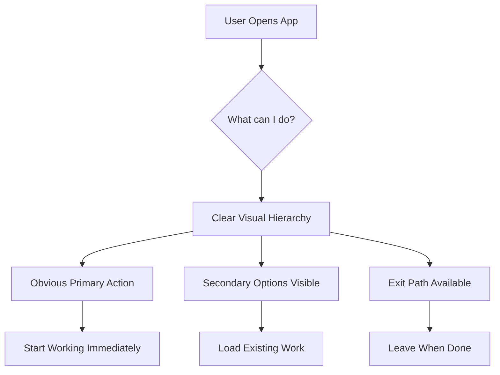
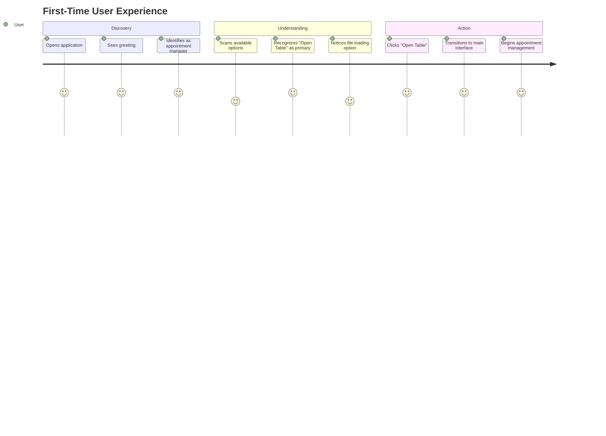
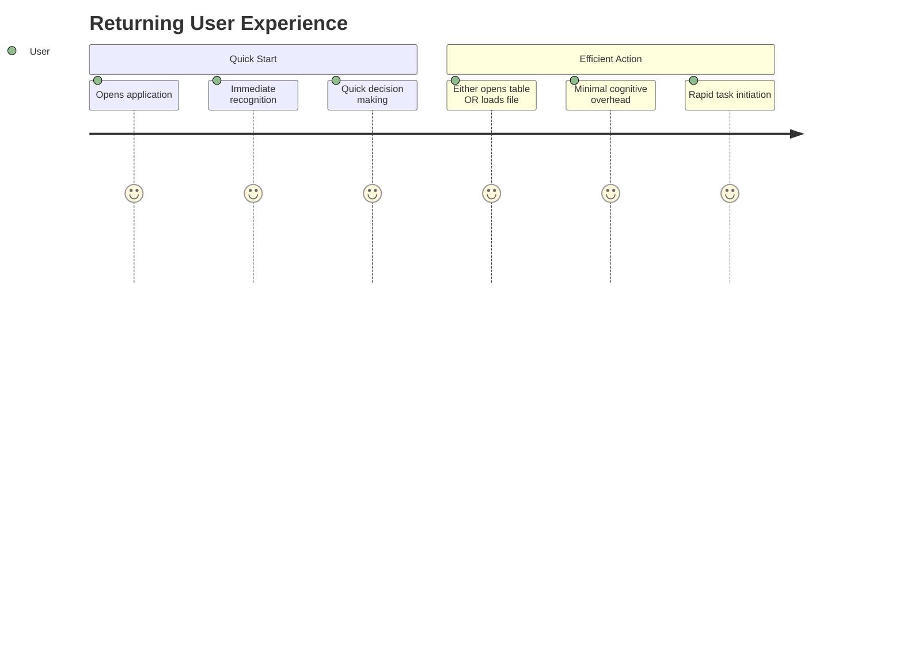

# 🎯 User Experience Design

## UX Design Philosophy

The Main Menu UX is built around three core principles: **Clarity**, **Efficiency**, and **Delight**. Every design decision supports these goals to create an intuitive and productive user experience.

## 🧠 User Mental Model

### User Expectations
When users first encounter the Main Menu, they expect:

```
Primary Goal: Start managing appointments quickly
Secondary Goal: Access existing appointment data
Tertiary Goal: Navigate the application confidently
```

### Cognitive Load Reduction


## 🎨 Visual Design Principles

### 1. **Immediate Orientation**
**Problem:** Users need to understand the application's purpose instantly
**Solution:** Clear branding and contextual greeting

```
Visual Elements:
├── App logo and title (top left)
├── Time-appropriate greeting (center)
└── Clear action buttons (left sidebar)

Result: Users understand they're in an appointment manager within 2 seconds
```

### 2. **Progressive Disclosure**
**Problem:** Too many options overwhelm users
**Solution:** Layered information architecture

```
Information Hierarchy:
Level 1: Primary action (Open Table) - Green, prominent
Level 2: Secondary action (Load File) - White, visible
Level 3: Utility actions (Window controls) - Subtle, available
Level 4: Exit option - Bottom placement, non-intrusive
```

### 3. **Affordance Communication**
**Problem:** Users need to understand what elements are interactive
**Solution:** Clear visual cues for interaction

```
Interactive Indicators:
├── Buttons: Distinct backgrounds, readable text
├── Drop Zone: Dashed border implies dropping
├── Title Bar: Cursor changes indicate draggability
└── Hover States: Immediate visual feedback
```

## 🔄 User Journey Mapping

### First-Time User Journey


### Returning User Journey


## 🎯 Interaction Design Patterns

### 1. **Immediate Feedback Pattern**
Every user action receives instant visual confirmation:

```
User Action → Immediate Response → System Processing → Final State

Examples:
├── Button Hover → Color Change → No Processing → Ready State
├── Drag Enter → Zone Highlight → Validation → Accept/Reject
├── Button Click → Visual Press → Navigation → New Scene
└── Window Drag → Position Change → Continuous Update → Final Position
```

### 2. **Forgiveness Pattern**
Users can easily recover from mistakes:

```
Error Scenarios & Recovery:
├── Wrong file dropped → Clear error message → Try again
├── Navigation fails → Remain on current screen → Retry available
├── File won't load → Error indication → Alternative paths available
└── Accidental drag → Exit drag area → Return to normal state
```

### 3. **Progressive Enhancement Pattern**
Multiple ways to accomplish the same task:

```
Load Existing File Options:
├── Primary: Click "Load from file" button → File browser
├── Alternative: Drag & drop .apf file → Direct loading
├── Fallback: If both fail → Clear error messaging

Benefits:
├── Accommodates different user preferences
├── Provides redundancy for critical actions
└── Supports various skill levels
```

## 📱 Accessibility & Inclusion

### 🎯 Motor Accessibility
```
Large Target Areas:
├── Buttons: Minimum 35px height for easy clicking
├── Drop Zone: Large area reduces precision requirements
├── Title Bar: Full width for window dragging
└── Generous Spacing: Reduces accidental activation
```

### 👁️ Visual Accessibility
```
High Contrast Design:
├── White text on dark backgrounds (4.5:1 ratio)
├── Green accent color provides clear distinction
├── Clear visual hierarchy through size and weight
└── No critical information conveyed by color alone
```

### ⌨️ Keyboard Accessibility
```
Navigation Support:
├── Tab order follows logical reading sequence
├── All interactive elements keyboard accessible
├── Enter key activates focused buttons
└── Escape key provides exit paths
```

### 🧠 Cognitive Accessibility
```
Clarity Features:
├── Single primary action reduces decision paralysis
├── Consistent terminology across interface
├── Predictable interaction patterns
├── Clear visual feedback for all actions
└── Minimal text with maximum clarity
```

## 📊 UX Success Metrics

### Task Completion Metrics
```
Time to First Action:
Target: <5 seconds from app launch to first meaningful action
Measurement: Time from initialize() to user interaction

Task Success Rate:
Target: >95% success rate for primary actions
Measurement: Successful navigation to table view

Error Recovery Rate:
Target: <3 seconds to recover from common errors
Measurement: Time from error state to working state
```

### User Satisfaction Indicators
```
Efficiency Measures:
├── Clicks to accomplish primary task: 1 click maximum
├── Time spent on main menu: Minimize (transition tool)
├── Return visit behavior: Quick recognition and action
└── Error frequency: Rare, with quick recovery

Qualitative Measures:
├── Intuitive interface (no training required)
├── Professional appearance (suitable for business use)
├── Responsive feedback (immediate interaction response)
└── Confident navigation (clear next steps)
```

## 🔮 User Behavior Patterns

### Expected User Types
```
New User (First Experience):
├── Explores interface carefully
├── Reads button labels completely
├── Cautious interaction style
└── Relies on visual cues heavily

Power User (Frequent Use):
├── Muscle memory interactions
├── Preference for keyboard shortcuts
├── Efficient workflow patterns
└── Minimal interface scanning
```

### Adaptation Strategies
```
For New Users:
├── Clear labeling and visual hierarchy
├── Obvious primary action path
├── Forgiving error handling
└── Progressive disclosure of features

For Power Users:
├── Fast interaction response
├── Multiple paths to same goal
├── Minimal UI interference
└── Consistent behavior patterns
```

## 🎪 Delight Factors

### Micro-Interactions
```
Pleasant Surprises:
├── Smooth drag & drop feedback
├── Time-appropriate greeting
├── Responsive visual states
└── Polished window controls
```

### Professional Polish
```
Quality Indicators:
├── Custom title bar (shows attention to detail)
├── Consistent visual language
├── Smooth animations and transitions
├── Error states that don't break experience
└── Cohesive color scheme and typography
```

### Emotional Design
```
User Feelings Goals:
├── Confident: Clear understanding of options
├── Efficient: Quick path to productivity
├── Professional: Suitable for business context
├── Comfortable: Familiar interaction patterns
└── Successful: Easy task completion
```

---
**Next:** [🔄 Integration](./07-integration.md) - Learn how the main menu integrates with other components
