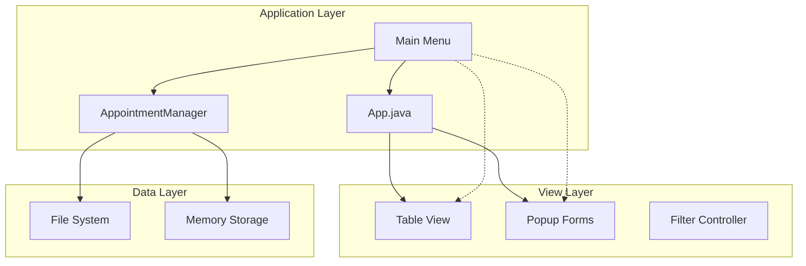
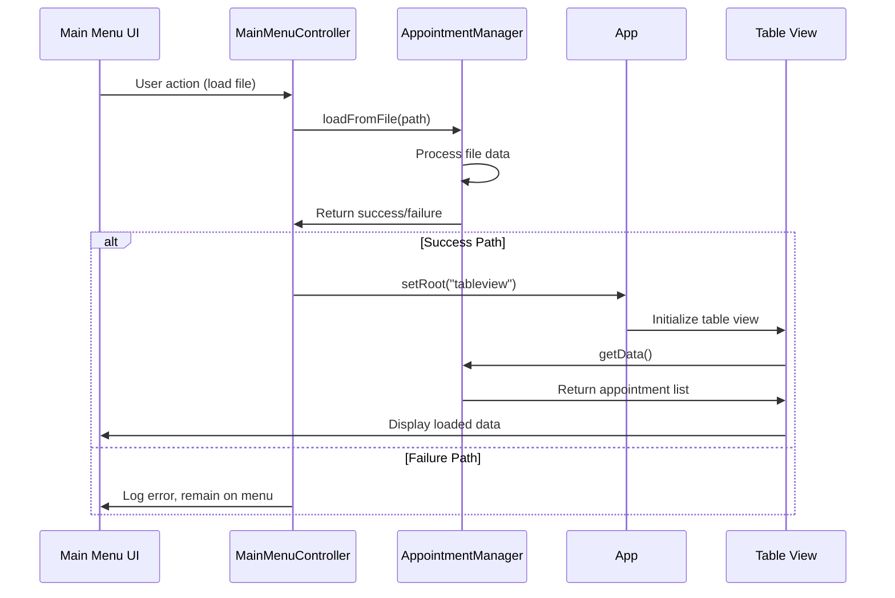

# 🔄 Main Menu Integration

## System Integration Overview

The Main Menu serves as the **central integration hub** that connects users to the broader Appointment Manager ecosystem. It coordinates with multiple system components to provide seamless functionality.

## 🏗️ Architecture Integration

### Application-Level Integration



### Integration Patterns

#### 1. **Scene Management Integration**
```java
Integration Point: App.java static methods
Purpose: Navigate between application views
Method: App.setRoot(sceneName)

Flow:
MainMenu → App.setRoot("tableview") → TableView loaded
MainMenu → File loaded → App.setRoot("tableview") → TableView with data
```

#### 2. **Data Management Integration**
```java
Integration Point: AppointmentManager singleton
Purpose: Shared application state
Method: AppointmentManager.getInstance()

Flow:
MainMenu → AppointmentManager.loadFromFile() → Data loaded
MainMenu → Navigate to TableView → Same data available
```

#### 3. **Resource Integration**
```java
Integration Point: JavaFX Resource Loading
Purpose: Shared assets and styling
Method: getClass().getResource()

Shared Resources:
├── App logo (used in main menu and table view)
├── CSS styles (consistent across views)
├── Icon pack (shared button icons)
└── FXML templates (consistent layout patterns)
```

## 🔗 Component Interactions

### File System Integration

#### File Loading Coordination
```java
Sequence:
1. MainMenu receives file (drag/drop or file chooser)
2. MainMenu → AppointmentManager.loadFromFile()
3. AppointmentManager → File system read
4. AppointmentManager → Parse and validate data
5. AppointmentManager → Store in memory
6. MainMenu → App.setRoot("tableview")
7. TableView → AppointmentManager.getData()
8. TableView → Display loaded appointments
```

#### File Format Integration
```java
File Type: .apf (Appointment File)
Validation: Extension checking in main menu
Processing: Delegated to AppointmentManager
Error Handling: Coordinated between components

Integration Benefits:
├── Centralized file format validation
├── Consistent error handling
├── Shared file processing logic
└── Unified user experience
```

### Window System Integration

#### Custom Title Bar Coordination
```java
Integration Challenge: No native OS title bar
Solution: Custom implementation in main menu
Coordination: Consistent across all views

Window Management Features:
├── Drag to move (implemented in main menu)
├── Minimize/Maximize/Close (delegated to Stage)
├── Custom styling (shared CSS resources)
└── Consistent behavior (pattern for other views)
```

#### Stage Management
```java
Integration Point: App.getPrimaryStage()
Purpose: Window control access
Scope: Available to all controllers

Shared Functionality:
├── Window positioning
├── Window state management
├── Modal dialog parenting
└── Icon and title management
```

## 📡 Data Flow Integration

### State Synchronization



### Memory Management Integration
```java
Integration Pattern: Singleton data persistence
Benefit: Consistent state across view transitions
Implementation: AppointmentManager.getInstance()

Memory Coordination:
├── Main Menu: Loads data into memory
├── Table View: Reads data from memory
├── Popup Forms: Modifies data in memory
└── Filter Controller: Filters data in memory
```

## 🔌 API Integration Points

### Internal API Contracts

#### Navigation API
```java
Interface: App.setRoot(String fxmlName)
Contract: 
- Parameter: Valid FXML file name (without extension)
- Behavior: Load specified scene as root
- Error Handling: IOException for missing files
- Thread Safety: Must be called on JavaFX Application Thread
```

#### Data Management API
```java
Interface: AppointmentManager.loadFromFile(String filePath)
Contract:
- Parameter: Valid file path to .apf file
- Returns: boolean (success/failure)
- Side Effects: Replaces current appointment data
- Thread Safety: Safe for concurrent read access
```

#### Window Control API
```java
Interface: Stage window management methods
Contract:
- setIconified(boolean): Minimize/restore window
- setMaximized(boolean): Maximize/restore window
- setX(double), setY(double): Position window
- Platform.exit(): Graceful application shutdown
```

### External System Integration

#### Operating System Integration
```java
File System Access:
├── FileChooser integration for file browsing
├── Drag & drop support via OS drag/drop events
├── File extension associations (future enhancement)
└── Native file validation

Window Management:
├── Taskbar integration (minimize behavior)
├── Alt+Tab window switching support
├── Screen resolution awareness
└── Multi-monitor support
```

#### JavaFX Platform Integration
```java
Event System:
├── Mouse events for window dragging
├── Drag & drop events for file operations
├── Key events for keyboard shortcuts
└── Platform events for application lifecycle

Resource Management:
├── FXML loading and caching
├── CSS stylesheet application
├── Image resource loading
└── Font and styling inheritance
```

## 🔄 Integration Challenges & Solutions

### Challenge 1: State Consistency
**Problem:** Ensuring data consistency across view transitions
**Solution:** Singleton pattern for AppointmentManager
```java
Benefits:
├── Single source of truth for appointment data
├── Automatic state preservation across scenes
├── Simplified data access patterns
└── Reduced synchronization complexity
```

### Challenge 2: Resource Sharing
**Problem:** Sharing assets and styles across components
**Solution:** Centralized resource organization
```java
Structure:
├── /assets/ - Shared images and logos
├── /iconpack/ - Common UI icons
├── /style/ - Shared CSS stylesheets
└── Consistent resource loading patterns
```

### Challenge 3: Error Propagation
**Problem:** Handling errors across component boundaries
**Solution:** Layered error handling strategy
```java
Layers:
├── UI Layer: Visual feedback and user messaging
├── Controller Layer: Error logging and recovery
├── Service Layer: Graceful degradation
└── Data Layer: Validation and sanitization
```

### Challenge 4: Threading Coordination
**Problem:** JavaFX thread safety requirements
**Solution:** Consistent threading patterns
```java
Guidelines:
├── All UI updates on JavaFX Application Thread
├── Platform.runLater() for async UI updates
├── Blocking operations off UI thread
└── Event-driven architecture for responsiveness
```

## 🔮 Future Integration Opportunities

### Database Integration
```java
Potential Enhancement: Replace file-based storage
Integration Points:
├── AppointmentManager.loadFromDatabase()
├── Real-time data synchronization
├── Multi-user support
└── Advanced querying capabilities
```

### Plugin System Integration
```java
Potential Enhancement: Extensible functionality
Integration Points:
├── Dynamic menu item addition
├── Custom file format support
├── External service integrations
└── Theme and styling plugins
```

### Cloud Integration
```java
Potential Enhancement: Cloud-based appointment storage
Integration Points:
├── Cloud file loading in main menu
├── Automatic synchronization
├── Cross-device appointment access
└── Collaborative features
```

---
**Next:** [🚀 Getting Started](./08-getting-started.md) - Quick start guide for developers working with the main menu
