# Use Case Diagram

This document presents the use case diagram for the Appointment Manager application, showing the interactions between users and the system.

## Use Case Diagram

## Alternative Simplified View

```mermaid
mindmap
  root((User))
    🏠 Main Menu
      Launch App
      Create File
      Load File
      Drag & Drop
      Navigate
      Exit
    📊 Appointments
      View All
      Add New
      Edit Existing
      Delete
      Update Status
    🔍 Search & Filter
      Real-time Search
      Advanced Filters
      Clear Filters
      Refresh View
    💾 File Operations
      Save Current
      Save As New
      Print Reports
      Export Data
    🪟 Window Controls
      Minimize
      Maximize
      Close
      Drag Move
```

## System Flow Diagram

## Use Case Categories

### 🏠 Main Menu Operations
- **Launch Application**: Start the appointment manager
- **Create New File**: Initialize a new .apf file
- **Load Existing File**: Open an existing .apf file via file chooser
- **Drag & Drop File**: Load file by dragging .apf file onto application
- **Navigate to Table View**: Switch from main menu to appointment table
- **Exit Application**: Close the application

### 📊 Appointment Management
- **View Appointments**: Display all appointments in table format
- **Add New Appointment**: Create a new appointment record
- **Edit Appointment**: Modify existing appointment details
- **Delete Appointment**: Remove an appointment from the system
- **Update Appointment Status**: Quick status change for appointments

### 🔍 Search & Filter Operations
- **Search Appointments**: Real-time text search across title and participant
- **Apply Advanced Filters**: Use complex filtering criteria
- **Clear Filters**: Remove all active filters
- **Refresh Table**: Manually refresh the appointment display

### 💾 File Operations
- **Save Appointments**: Save current appointments to file
- **Save As New File**: Save appointments to a new .apf file
- **Print Appointments**: Generate printed reports
- **Export Data**: Output appointment data

### 🪟 Window Management
- **Minimize Window**: Minimize application to taskbar
- **Maximize Window**: Toggle between windowed and fullscreen
- **Close Window**: Terminate the application
- **Drag Window**: Move window by dragging title bar

## Use Case Relationships

### Include Relationships
- **Appointment CRUD operations** → **Auto-save**: All data modifications automatically trigger save operations
- This ensures data persistence without explicit user action

### Extend Relationships
- **Drag & Drop File** → **Load Existing File**: Drag & drop provides an alternative method to load files
- **Save As New File** → **Save Appointments**: Save As extends basic save with file chooser functionality

## Primary Actor
- **User**: The person using the appointment manager application
- Single user system (no multi-user scenarios)
- No authentication or authorization requirements

## System Boundary
The system includes:
- JavaFX user interface components
- Data management and persistence layer
- File I/O operations
- Print functionality

The system excludes:
- Network operations
- External system integration
- Multi-user capabilities
- Cloud storage
